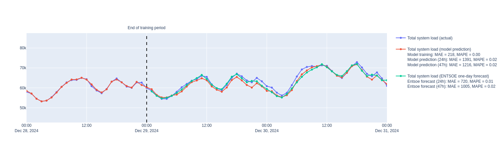
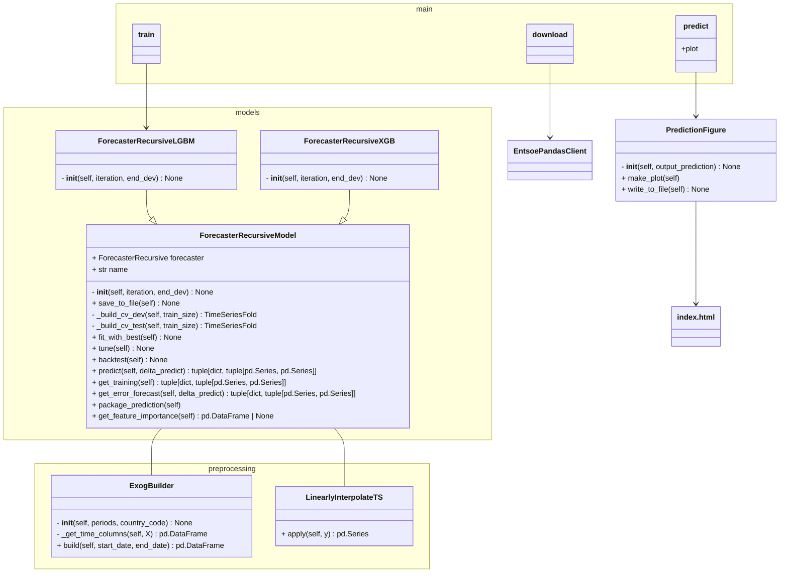

# Energy demand forecaster for France

#### -- Project Status: [ Active ]

## Project Intro/Objective
The goal of this project is to build, train and tune a prediction model for timeseries and then use it to forecast data.
A demo is available using [Github Pages](https://nicolaschagnet.github.io/energy-demand-forecast/).
<!--
### Collaborators
|Name     |  Github Page   |  Personal Website  |
|---------|-----------------|--------------------|
|Nicolas Chagnet | [NicolasChagnet](https://github.com/NicolasChagnet)| [nicolaschagnet.github.io](https://nicolaschagnet.github.io)  | -->



### Data sources

* [France actual energy load](https://transparency.entsoe.eu/load-domain/r2/totalLoadR2/show?name=&defaultValue=false&viewType=GRAPH&areaType=CTA&atch=false&dateTime.dateTime=01.07.2024%2000:00|CET%7CDAYTIMERANGE&dateTime.endDateTime=01.07.2024%2000:00|CET%7CDAYTIMERANGE&biddingZone.values=CTY%7C10YFR-RTE------C!CTA%7C10YFR-RTE------C&dateTime.timezone=CET_CEST&dateTime.timezone_input=CET+(UTC+1)+/+CEST+(UTC+2))

The data is sourced using the [Entsoe Python Client](https://github.com/EnergieID/entsoe-py).

### Technologies
* Python (Pandas, Scikit-learn, numpy)
* Skforecast (LGBM and XGBoost models)
* Plotly for visualizations

## Project Description

In this project, I have built a pipeline to download and process regularly updated data from [Entsoe](https://transparency.entsoe.eu/), a European platform promoting transparency of data regarding energy production.
The package in this project can download data on the French energy grid (both actual system load and the one-day ahead forecast provided by Entsoe) to then train various models (LGBM mostly, XGBoost is also supported) using the [Skforecast](https://skforecast.org) library. These models predict new data and can be visually and quantitativel compared to the provided day-ahead forecast on the [generated figure](https://nicolaschagnet.github.io/energy-demand-forecast/).


The model is initially trained on historical data from 2020 until the end of 2024, and is then re-trained every week using a new batch of data. The training also consists of tuning for hyperparameters using Bayesian search with a backtesting cross-validation setup. 

The structure of the code can be symbolically represented through its classes and interfaces:



## Getting Started

1. Clone this repository.
2. The raw data is being kept [here](data/raw) within this repo.
3. Data processing/transformation scripts are being kept [here](src/).
4. Exploratory data analysis can be found in a Jupyter notebook [here](notebooks/0_exploratory_data_analysis.ipynb) (deprecated).

Here is how to run the interface
```bash
usage: main.py [-h] {download,predict,train,merge} ...

Prediction of energy demand in France

positional arguments:
  {download,predict,train,merge}

options:
  -h, --help            show this help message and exit
```


## Featured Notebooks/Analysis/Deliverables
* [Proof of concept](notebooks/0_exploratory_data_analysis.ipynb)
* [Demo](https://nicolaschagnet.github.io/energy-demand-forecast/)
