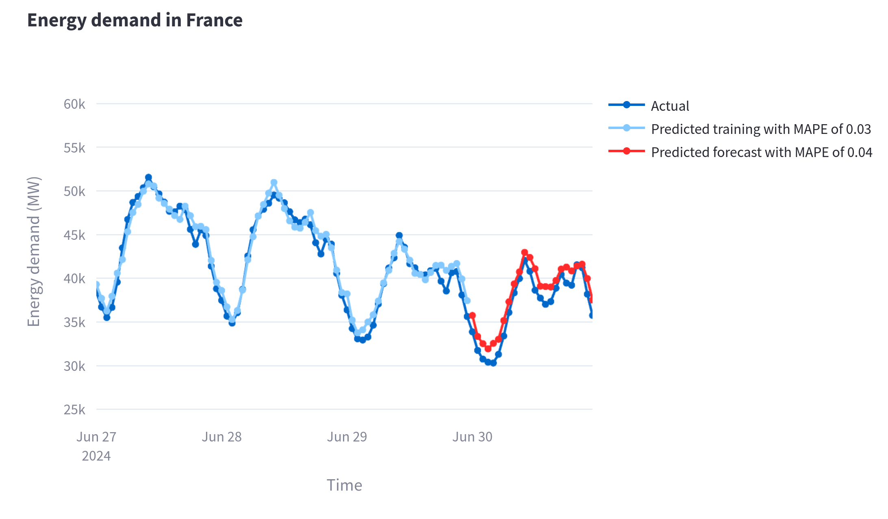
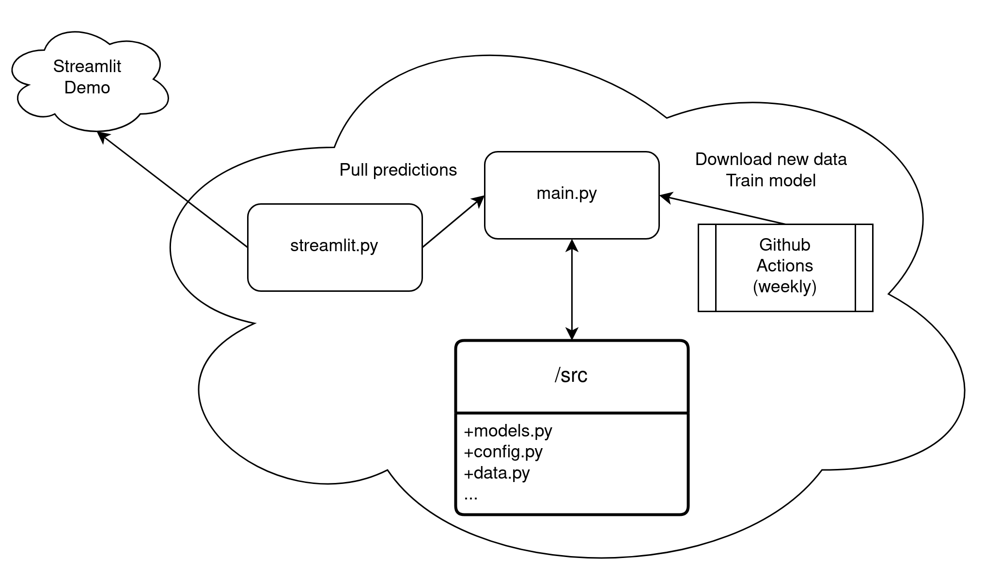

# Energy demand forecaster for France

#### -- Project Status: [ Active ]

## Project Intro/Objective
The goal of this project is to build, train and tune a prediction model for timeseries and then use it to forecast data.
A demo is available on [Streamlit](https://energy-demand-forecast-france.streamlit.app/).
<!--
### Collaborators
|Name     |  Github Page   |  Personal Website  |
|---------|-----------------|--------------------|
|Nicolas Chagnet | [NicolasChagnet](https://github.com/NicolasChagnet)| [nicolaschagnet.github.io](https://nicolaschagnet.github.io)  | -->



### Data sources

* [France actual energy load](https://transparency.entsoe.eu/load-domain/r2/totalLoadR2/show?name=&defaultValue=false&viewType=GRAPH&areaType=CTA&atch=false&dateTime.dateTime=01.07.2024%2000:00|CET%7CDAYTIMERANGE&dateTime.endDateTime=01.07.2024%2000:00|CET%7CDAYTIMERANGE&biddingZone.values=CTY%7C10YFR-RTE------C!CTA%7C10YFR-RTE------C&dateTime.timezone=CET_CEST&dateTime.timezone_input=CET+(UTC+1)+/+CEST+(UTC+2))


### Methods Used
* Data Analysis
* Machine Learning
* Data Visualization
* Predictive Modeling
* API queries

### Technologies
* Python
* Pandas, Scikit-learn, numpy

## Project Description
In this project, I have built a forecasting model for regularly updated energy load data for France. In this [notebook](notebooks/0_exploratory_data_analysis.ipynb), I analyze the data of total energy load for France from 2019 up to 2024, and build a proof of concept for the various features required for the forecast, and compare models between the Random Forest and LightGBM. I found the LightGBM to be more performant in terms of Mean Absolute Percentage Error and in terms of training time.

I then built an automatized interface for downloading new data, training the model and eventually making new predictions. The training is made on all the data up to some cutoff (usually set about one day before the new data) and the model is retrained weekly.
A live demo is available on [Streamlit](https://energy-demand-forecast-france.streamlit.app/).



## Getting Started

1. Clone this repository.
2. Raw data is being kept [here](data/raw) within this repo.
3. Data processing/transformation scripts are being kept [here](src/).
4. Exploratory data analysis can be found in a Jupyter notebook [here](notebooks/0_exploratory_data_analysis.ipynb).

Here is how to run the interface
```bash
usage: main.py [-h] [-d] [-p] [-t] [--force]

Prediction of energy demand in France

options:
  -h, --help      show this help message and exit
  -d, --download  Download new data
  -p, --predict   Predict data
  -t, --train     Train and tune a new model
  --force         Force training of new model
```


## Featured Notebooks/Analysis/Deliverables
* [Proof of concept](notebooks/0_exploratory_data_analysis.ipynb)
* [Streamlit Demo](https://energy-demand-forecast-france.streamlit.app/)
